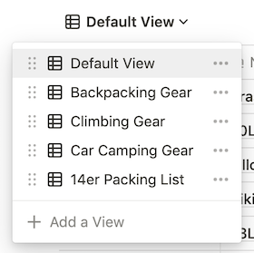
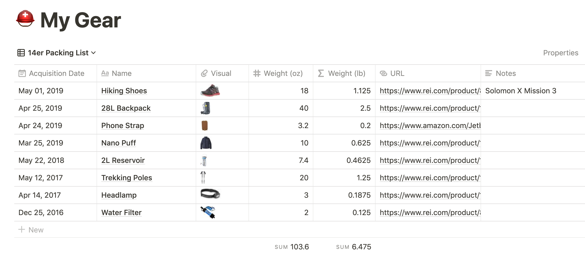

Over the weekend, I decided to formally document all of my backpacking, camping, hiking, and climbing gear. I wanted to create a centralized tracker for a few reasons, the most important few being:

- Figuring out when it's time to replace a piece of gear, based on the length of time I've owned it and condition it's currently in
- Tracking the weight of my pack, dependent on trip type (i.e. backpacking trips require different gear than day hikes)

I haven't used Notion as an inventory source for my possessions before, so I browsed the [template gallery](https://www.notion.so/Notion-Template-Gallery-181e961aeb5c4ee6915307c0dfd5156d) for inspiration. This [plant tracker](https://www.notion.so/Plant-tracker-faafcfcf6a9d4f10b579d9351ecaaebc) from [@maggieyue](https://twitter.com/yuemaggie) looked like a good template to duplicate for something like this, so I went for it. I made a few changes to the plant tracker (while also maintaining a separate duplicate of the plant tracker for [my own plants](https://www.notion.so/kalestew/Plants-3e733a7a27e248c79f22042032411a7b) because this template is awesome), but overall I found it served my needs very well.

## Changes Made

I only made a handful of changes transitioning the [Plant Tracker](https://www.notion.so/Plant-tracker-faafcfcf6a9d4f10b579d9351ecaaebc) into a [Gear Tracker](https://www.notion.so/kalestew/abebdb4997514ef8882e13b1d00baebf?v=6691b68442e64533a85138d04b75912d).

Properties I kept

- `Acquisition Date` - I found this could represent the same piece of data for both tables
- `Name` - as an identifying column, it doesn't get much simpler than a simple name
- `Visual` - attaching an image of the item is a nice organizational step
- `Care & Notes` - turned into just a plain `Notes` but kept it for quick reminders

Properties I added

- `URL` - a link to the product or the latest version of the product, if applicable
- `Weight (oz)` - I've found it's easier to obtain a weight in ounces and then convert it to pounds, but this might not be the case for a different variety of item you are trying to inventory
- `Weight (lb)` - a formula that relates to the weight in ounces and divides it by 16, so I can sum both columns separately
- `Category` - options include `Backpacking`, `Car Camping`, `Day Hike`, etc. - allows me to sort items by trip type (see [Views](#views) for more details)

Properties I got rid of

- `Botanical Name`, `Date Watered`, `Date Fertilized`, and `Water Propogation` - for obvious reasons
- `Location` and `Location Notes` - the location of my gear when I'm not using it doesn't matter quite as much as it does with plants

## Views

Hinging around the `Category` property, I've created a few different views of this Gear table to serve as a packing list of sorts for various activities.

When one navigates to the view, it's filtered down to the appropriate category and I've hidden that property column entirely to clean up the view.

## In Conclusion

It's very simple to appropriate a template for your own uses, if you're willing to make some small changes. Thanks to flexibility of databases within Notion, it's also very simple to change the way you consume that data.

Thanks for reading about my Gear Tracker and the approach I took to get here! Check out [my other Notion posts](https://www.kyliestewart.tech/blog) for more organizational fun.
